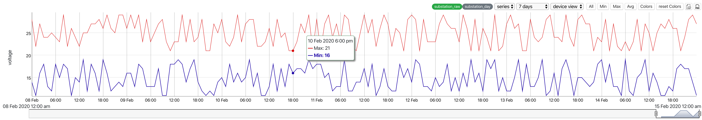

# fgp-graph
fgp-graph bases on dygraphs and uses typescript as development langulage. It allows future-grid customer to explore their timeseries aggregations data sets.
Here's how the fgp-graphs works:


1. **Typescript**
  ```javascript
      let graphDiv: HTMLDivElement = document.getElementById("graphArea") as HTMLDivElement;
      let fgpGraph = new FgpGraph(graphDiv, [vsConfig]);
      fgpGraph.initGraph();
  ```
2. **React**
  ```javascript
      let fgpGraph = new FgpGraph(document.getElementById('graphArea'), [
            vdConfig,
            vsConfig
      ]);
      fgpGraph.initGraph();
  ```
3. **Angular2**
  ```
      coming soon~
  ``` 

This graph is interactive as same as dygraphs, but some changes are made to meet the needs of futuregrid customer requirements. You can scroll up and down on both left and right axis to scale the y-ranges. You can also zoom-in & zoom-out on graph in the same way. Panning on those area has same effect.  

This graph is highly configurable. You can put mulitple "VIEW"(datasource) to this graph and swap them with the "dropdown" easily. You can download data and save current graph as a image. There are "callbacks" can be used to monitoring the date window and highlighting(selection) events.

## Geeting Started
Once you`ve got ready to put it in your project, please check the demos or check out our github wiki.

If you're using npm and a bundler like webpack, browserify or rollup, you can install fgp-graph via:
```
npm install --save @futuregrid/fgp-graph
```
and use it via:
```javascript
import FgpGraph from '@future-grid/fgp-graph';
    //...... your code ......//

    let fgpGraph = new FgpGraph(document.getElementById('graphArea'), [
          vdConfig,
          vsConfig
    ]);
    fgpGraph.initGraph();

    //...... your code ......//
```

Check out the [React demo](https://github.com/flexdeviser/fgp-graph-react) for more details.

## Options Reference
If you are a dygrpahs user, please don't put dygraphs options in fgp-graph. fgp-graph has its own options and different formats.
### Usage
```javascript
let vdConfig: ViewConfig = {
    name: "device view",
    graphConfig: {
        features: {
            zoom: true,
            scroll: true,
            rangeBar: true,
            legend: formatters.legendForAllSeries,
            exports: [GraphExports.Data, GraphExports.Image]
        },
        entities: [
            { id: "substation1", type: "substation", name: "**F**substation" },
        ],
        rangeEntity: { id: "substation1", type: "substation", name: "**F**substation" },
        rangeCollection: {
            label: 'substation_day',
            name: 'substation_interval_day',
            interval: 86400000,
            series: [
                { label: "Avg", type: 'line', exp: "data.avgConsumptionVah" }
            ]
        },
        collections: [
            {
                label: 'substation_raw',
                name: 'substation_interval',
                interval: 3600000,
                series: [
                    { label: "Avg", type: 'line', exp: "data.avgConsumptionVah", yIndex: 'left', color: '#058902' },
                    { label: "Max", type: 'line', exp: "data.maxConsumptionVah", yIndex: 'left', color: '#d80808' },
                    { label: "Min", type: 'line', exp: "data.minConsumptionVah", yIndex: 'left', color: '#210aa8' }
                ],
                threshold: { min: 0, max: (1000 * 60 * 60 * 24 * 10) },    //  0 ~ 10 days
                yLabel: 'voltage',
                y2Label: 'voltage',
                initScales: { left: { min: 245, max: 260 } },
                fill: false
            }, {
                label: 'substation_day',
                name: 'substation_interval_day',
                interval: 86400000,
                series: [
                    { label: "Avg", type: 'line', exp: "data.avgConsumptionVah", yIndex: 'left' },
                    { label: "Max", type: 'line', exp: "data.maxConsumptionVah", yIndex: 'left' },
                    { label: "Min", type: 'line', exp: "data.minConsumptionVah", yIndex: 'left' }
                ],
                threshold: { min: (1000 * 60 * 60 * 24 * 10), max: (1000 * 60 * 60 * 24 * 7 * 52 * 10) },    // 7 days ~ 3 weeks
                yLabel: 'voltage',
                y2Label: 'voltage',
                initScales: { left: { min: 230, max: 260 } },
                fill: false
            }
        ]

    },
    dataService: dataService,
    show: true,
    ranges: [
        { name: "7 days", value: 604800000, show: true },
        { name: "1 month", value: 2592000000 }
    ],
    initRange: {
        start: moment().subtract(10, 'days').startOf('day').valueOf(),
        end: moment().add(1, 'days').valueOf()
    },
    interaction: {
        callback: {
            highlighCallback: (datetime, series, points) => {
                // console.debug("selected series: ", series);
            },
            syncDateWindow: (dateWindow) => {
                console.debug(moment(dateWindow[0]), moment(dateWindow[1]));
            }
        }
    },
    timezone: 'Australia/Melbourne'
};

let fgpGraph = new FgpGraph(document.getElementById('graphArea'), [
          vdConfig
    ]);
```
### ViewConfig
#### Display
###### name
All views configuration has a name and you will find it in the "views" dropdownd list. It's a key of view and should be exclusive.
type: string
default: none
###### timezone
You should let the graphs know what timezone that data blongs to. You can find the right timezone for your data by googling

type: string
default: none
```
Australia/Melbourne     Pacific/Auckland
```


###### show
fgp-graph will find the last view config with "show: true", then show it first.

type: boolean
default: false

###### ranges
array of configuration to let you change datewindow easier.
```json
[{ name: "7 days", value: 604800000, show: true },{ name: "1 month", value: 2592000000 }]
```
+ **name**
  show this name in range dropdown list</br>
  type: string
  default: none
+ **value**
  gap in milliseconds</br>
  type: number
  default: none
+ **show**
  tells graph which one should show first</br>
  type: boolean
  default: false


###### initRange
this is another way to tell graph what timewindow you want to show first. graph will ignore "ranges" configuration with this attribute.

```json
{start: moment().subtract(10, 'days').startOf('day').valueOf(),end: moment().add(1, 'days').valueOf()}
```
+ **start**
  type: number(timestamp)
  default: none
+ **end**
  type: number(timestamp)
  default: none
#### Graph
###### features
+ **zoom**
  enable/disable zoom</br> 
  type: boolean
  default: false</br>

+ **scroll**
  enable/disable scroll</br>
  type: boolean
  default: false</br>

+ **rangebar**
  show/hide rangebar</br>
  type: boolean
  default: false</br>

+ **legend**
  legend formatter, there are 2 formatters included in @future-grid/fgp-graph/lib/extras/formatters</br>
  type: function(data):htmlstr
  default: none
  provider: legendForAllSeries(device view) legendForSingleSeries(children view)</br>

+ **exports**
  enable/disable export buttons</br>
  type: Array<string>
  default: none
  provider: GraphExports.Data and GraphExports.Image

###### Entities
array of devices

+ **id**
  device name from futuregrid platform
+ **type**
  device type from futuregrid platform
+ **name**
  device description(extension) from futuregrid platform

sample:
```json
[{ id: "meter1", type: "meter", name: "meter1" },{ id: "meter2", type: "meter", name: "meter2" }]
```
 
###### RangeEntity
single device and should always be the parent of "entities"

+ **id**
  device id from futuregrid platform, you can put device name here
+ **type**
  device type from futuregrid platform
+ **name**
  device name from futuregrid platform

sample:
```json
{ id: "substation1", type: "substation", name: "substation1" }
```

###### RangeCollection
this "collection" is a futuregrid interval configuration. Graph will call "dataservice" to get the frist and last record and render the rangebar with that timewindow. But most time insted of last record with current datetime.

+ **label**
  label of the "interval", different or same to interval name</br>
  type: string
  default: none


+ **name**
  name of the "interval"</br>
  type: string
  default: none
+ **interval**
  interval in milliseconds</br>
  type: numnber
  default: none

+ **series**
  Array of series configuration, but only one needed. we just need one line in the rangebar.

  + **label**
    show this label when hover the line 
  + **type**
    "line", "bar" or any other types supported by graph. Right now only "line" worked.
  + **exp**
    expression for data calculation. 
    ```
    "data.avgConsumptionVah * 10"
    ```
    "data." is a prefix for the attribute from data

###### Collection
this "collection" is similar to RangeCollection, but shown on main graph. you can put multiple collections there and graph will swap them base on "threshold"

+ **label**
  label of the "interval", different or same to interval name</br>
  type: string
  default: none


+ **name**
  name of the "interval"</br>
  type: string
  default: none
+ **interval**
  interval in milliseconds</br>
  type: numnber
  default: none

+ **series**
  Array of series configuration, but only one needed.</br>
  ```json
  [{ label: "Voltage", type: 'line', exp: "data.voltage", yIndex: 'left' }]
  ```
  + **label**
    show this label when hover the line 
  + **type**
    "line", "bar" or any other types supported by graph. Right now only "line" worked.
  + **exp**
    expression for data calculation. 
    ```
    "data.avgConsumptionVah * 10"
    ```
    "data." is a prefix for the attribute from data
  + **yIndex**
    left(0) or right(1) axes

+ **threshold**
  Tells graph to show it in a particular datetime range.</br>
  ```json
  { min: (1000 * 60 * 60 * 24 * 10), max: (1000 * 60 * 60 * 24 * 7 * 52 * 10) }
  ```
  + **min**
    type: number(timestamp)
    default: none
  + **max**
    type: number(timestamp)
    default: none
+ **initScales**
  value ranges for left and right Y-Axes. leave it empty the graph will calculate with max and min from value, then add 10% offset to min and max.
  ```json
  { left: { min: 245, max: 260 }, right: { min:10, max:30 } }
  ```
  + **left**
    + **min**
      type: number
      default: none
    + **max**
      type: number
      default: none
  + **right** 
    + **min**
      type: number
      default: none
    + **max**
      type: number
      default: none
+ **yLabel** 
  label of y-axes</br>
  type: string
  default: none


#### Datasource
You need to provide a datasource base on "DataHandler" interface. There are two methods with "Promise" return value.
+ **fetchFirstNLast**
  ```javascript
  fetchdata(ids: Array<string>, interval: string, range: { start: number; end: number }, fields?: Array<string>): Promise<Array<{ id: string, data: Array<any> }>>;
  ```
+ **fetchdata**
  ```javascript
  fetchFirstNLast(ids: Array<string>, interval: string, fields?: Array<string>): Promise<Array<{ id: string, data: { first: any, last: any } }>>;
  ```

   All date that you provided should have the attributes in series coniguration and "timestamp" attribute as timeseries field.
   check the react demo for more details


#### Interactions
Every time you change the datetime range or highlighting series on graph, the graph will call "callback" that you provided. You can do what you want, just like highlight something on map or redirect to another page.
+ **callback**
  + **highlighCallback**
    ```js
    (datetime, series, points) => {
      // console.debug("selected series: ", series);
    }
    ```
    + **datetime**
      timestamp of the points
    + **series**
      series name
    + **points**
      points value
  + **clickCallback**
    ```js
    (series) => {
      // console.debug("choosed series: ", series);
    }
    ```
    + **series**
      series name